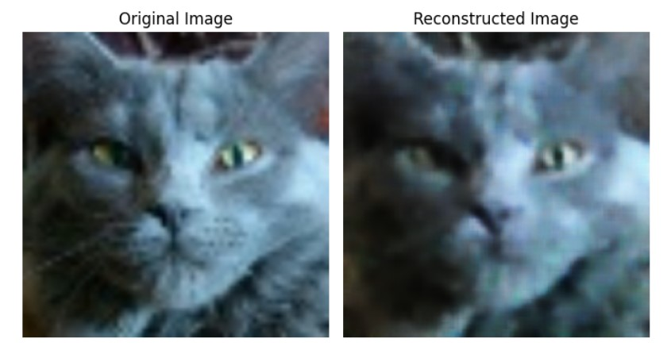
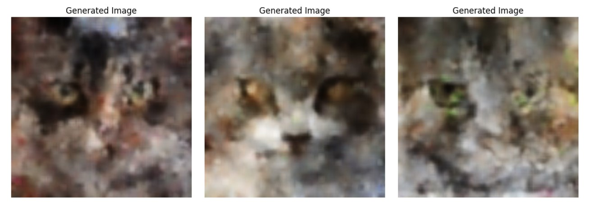

# Cat Image Synthesis with Variational Autoencoder (VAE)

This project implements a Variational Autoencoder (VAE) to generate synthetic cat images from a dataset of close-up cat photos. The model learns a compressed latent representation of cat faces and can both reconstruct input images and generate new ones by sampling from the latent space.

## Model Architecture

The encoder consists of three convolutional layers with increasing filter counts (32, 64, 128), each using a kernel size of 4 and stride of 2. After flattening, fully connected layers produce the mean (mu) and log-variance (logvar) vectors of size 128.

The decoder mirrors the encoder with three transposed convolutional layers, progressively reducing channel dimensions back to 3 (RGB). The final layer uses sigmoid activation to output pixel values in the [0,1] range.

The reparameterization trick is used to enable backpropagation through the sampling operation.

Download the model checkpoint from Google Drive:
**[VAE - Trained Weights (50 epochs)](https://drive.google.com/TBA)**  (TBA)

## Dataset & Training

The VAE is trained on a dataset of 29,843 cat images. The model learns to encode images into a lower-dimensional latent space and then decode them back to the original image space. The dataset can be found [here](https://www.kaggle.com/datasets/borhanitrash/cat-dataset).

- Epochs: 50
- Learning Rate: 0.001
- Optimizer: Adam
- Batch Size: 64
- Loss Function: Binary Cross-Entropy (reconstruction) + KL Divergence (regularization)

### Image Reconstruction Samples

  

### Image Generation Samples

The model can generate new cat images by sampling random vectors from a standard normal distribution and passing them through the decoder.

  

Note that the current model produces blurry or low-quality generations. A Beta-VAE variant could improve results by introducing a weighting factor Beta on the KL divergence term.

## License

This project is licensed under Apache License 2.0. See the [LICENSE](LICENSE) file for more details.
